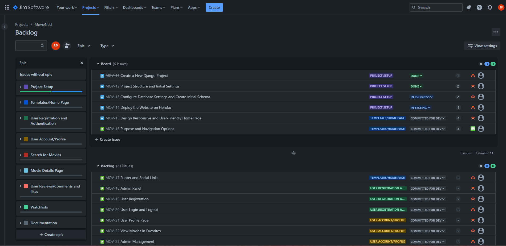
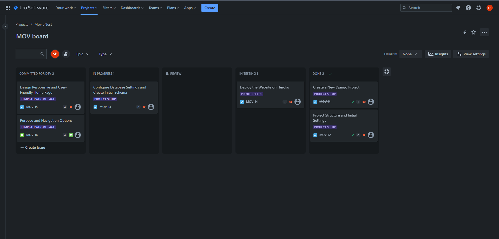
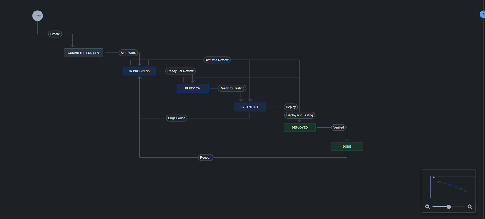

# **MovieNest**

## Introduction

MovieNest is a website made for movie made for movie enthusiasts. It is a full stack project built with Django framwork for the backend. HTML, CSS and JavaScript are used for the projects front-end part. Bootstrap is also used for design and responsive development. MovieNest allows users to easily see top rated and trending movies. Users are also able to create accounts and submit reviews of movies already watched, as well as reading and commenting reviews made by others.The website also features the posibility to add interesting movies to "favorites".

[MovieNest Live Website](https://movie-nest-cc8eb513ed09.herokuapp.com/)

---

## Agile Development

The project was developed using an agile workflow and agile principles. Jira was the tool used to keep all of it together. Epics, user stories and developer stories were created and then added to the backlog. The backlog is were the stories are reviewed, refined and then committed for development. 

### Workflow

Backlog

Jira's backlog feature was used in combination with the Kanban template. The stories start in the backlog after they are created. Here they are assigned to Epics and prioritized using the MoSCoW method. Subtasks and Acceptance criteria are added to the user stories in an effort to better outline the requirements for each story to be completed. Story points are also assigned to estimate the overall effort required to complete a user story.

Board

After a user story is refined, it is sent to the Board.

- Committed for Dev: This status is used for refined stories that are ready to be worked on.
- In Progress: The user stories that are currently in progress.
- In Review: This status is used to review the code one more time before testing.
- In Testing: This status is used for manual testing.
- Deployed: Deployed to Heroku to see that everything works in production ( Note that I didn't deployed after each story was completed).
- Done: Completed user stories.

Workflow Scheme

## User Experience(UX)

### User Stories

#### **Epic: Project Setup**

* **Task: As a developer, I want to create a new Django project.**
* **Task: As a developer, I want to establish the project structure and initial settings.**
* **As a developer, I want to configure the database settings for the project and create the initial database schema.**
* **Task: As a developer, I want to deploy the website on Heroku.**

#### **Epic: Templates/ Home Page**

* **Task: As a developer, I want to create a responsive and user-friendly home page design.**
* **User Story: As user, I want to immediately understand its purpose and navigation options.**
* **User Story: As a user, I want to be able to get in touch with the site owner.**

#### **Epic: User Registration and Authentication**

* **User Story: As an admin, I want access to an admin panel where I can manage the website's content.**
* **User Story: As a user, I want to be able to register for an account.**
* **User Story: As a registered user, I want to be able to log in and out from my account.**

#### **Epic: User Account/Profile**

* **User Story: As a registered user, I want to have a profile page where I can view and edit my user information.**
* **User Story: As a registered user, I want to be able to view movies that I liked (favourites).**
* **User Story: As an admin, I want to be able to manage user accounts, including disabling or banning accounts when necessary.**

#### **Epic: Search for Movies**

* **Task: As a developer, I want to integrate a movie database API so that I can retrieve movies for my project.**
* **User Story: As a user, I want to be able to search for movies using keywords or titles.**
* **User Story: As a user, I want to see the search results presented in a user-friendly and responsive format.**

#### **Epic: Movie Details Page**

* **Task: As a developer, I need to design and create a template for displaying movie details.**
* **User Story: As a user, I want to view detailed information about a movie when I click on a movie title.**
* **User Story: As a user, I want to read user-generated reviews for the movie to get an idea of its quality.**
* **User Story: As a user, I want to see the average rating for a movie.**

#### **Epic: User Reviews/Comments and likes**

* **User Story: As a registered user, I want to be able to submit a review for a movie.**
* **User Story: As a registered user, I want to comment on reviews written by others.**
* **User Story: As a user, I want to edit and delete my own reviews and comments.**
* **User Story: As a registered user, I want to be able to like movies, adding them to my list of favourites.**
* **User Story: As an admin, I want to be able to delete inappropriate reviews and comments.**

#### **Epic: Watchlists**

* **User Story: As an admin, I want to create, edit, and delete watchlists.**
* **User Story: As a registered user, I want to view and comment on different watchlists.**

### Database Scheme

#### Initial Scheme

**Relationships:**

* The User Profile has One-to-Many relationship with the Review and Comments models. One user can write multiple reviews and comments.
* The User Profile has also Many-to-Many relationship with the Watchlist model. Admins can create multiple watchlists.

* The Movie model has One-to-Many relationship with the Review model. One movie can have multiple reviews.
* The Movie model has Many-to-Many relationship with the Watchlist model. Movies can be in multiple watchlists.

* The Review model has One-to-Many relationship with the Comments model. One review can have multiple comments.

